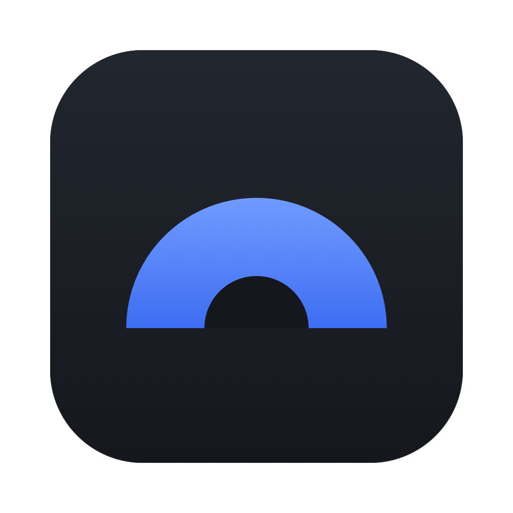

<p align="center">
  
</p>

<h1 align="center">Burrow Client</h1>

<p align="center">
  A local-first SSH client for macOS and Linux.<br>
  No account, no telemetry, no cloud unless you run it yourself.
</p>

<p align="center">
  <a href="https://github.com/zukotuutori/ssh-client/releases">Download</a> ·
  <a href="SECURITY.md">Security</a> ·
  <a href="server/README.md">Sync server</a> ·
  <a href="https://ko-fi.com/zukotuutori">Support on Ko-fi</a>
</p>

---

Burrow keeps your hosts, keys and passwords on your own machine. Secrets sit in an encrypted vault that only opens with your master password. If you use more than one computer, you can host a small sync server yourself, and it only ever stores data it can't read.

## Features

**Terminal**
- Tabs with split panes, side by side or stacked
- Local shell tabs next to your SSH sessions
- Snippets: save commands once and send them to any terminal, globally or per host

**Hosts**
- Host profiles with groups, search and notes
- Optional status dot that shows whether a host is reachable
- Password or key login, with the password saved or asked each time

**Keys and trust**
- Generate Ed25519 or RSA 4096 keys, or import existing ones (passphrases supported)
- Known hosts: the first connection shows the server's fingerprint for you to confirm, and a changed key blocks the connection until you decide
- Legacy SHA-1 algorithms are turned off

**Files**
- SFTP browser with drag and drop upload, download, rename, delete and new folders

**Privacy**
- Passwords, private keys and passphrases are encrypted with your master password (scrypt + AES-256-GCM)
- Auto-lock after idle time, on sleep and when the screen locks
- The window is hidden from screenshots and screen recordings on macOS (can be turned off)
- Optional end-to-end encrypted sync to a server you run

## Install

Grab the latest build from the [Releases page](https://github.com/zukotuutori/ssh-client/releases).

### macOS

1. Open the `.dmg` and drag **Burrow Client** into Applications.
2. Start it. macOS will say it can't verify the app, because the build isn't signed with an Apple developer certificate. Click **Done**.
3. Go to **System Settings → Privacy & Security**, scroll down and click **Open Anyway** next to Burrow Client.

You only need to do this once. If you'd rather not trust a downloaded binary, [build it yourself](#building-from-source), it only takes a couple of minutes.

### Linux

On Fedora and other RPM based distributions:

```bash
sudo dnf install ./Burrow*.rpm
```

Everywhere else, use the AppImage:

```bash
chmod +x Burrow*.AppImage
./Burrow*.AppImage
```

## Getting started

1. **Create a master password.** It encrypts everything secret. There is no reset and no recovery, so put it in your password manager.
2. **Add a host** under Hosts. Pick password or key login. For key login, generate or import a key under Keychain first and copy its public key to the server's `~/.ssh/authorized_keys`.
3. **Connect.** The first time, Burrow shows the server's key fingerprint. Compare it with what the server admin gave you (or with `ssh-keygen -lf /etc/ssh/ssh_host_ed25519_key.pub` on the server) before you accept.

## Sync between devices

Sync is optional and off by default. You run the server yourself, it's a single Node.js file with no dependencies, and the app encrypts everything before it leaves your device. The server sees user names and upload times, never your hosts, passwords or keys.

Setup, Docker files and reverse proxy examples are in [server/README.md](server/README.md). Once it's running, log in under **Settings → Sync**.

## Keyboard shortcuts

| Action | macOS | Linux |
|---|---|---|
| Split right | <kbd>⌘</kbd> <kbd>D</kbd> | <kbd>Ctrl</kbd> <kbd>Shift</kbd> <kbd>D</kbd> |
| Split down | <kbd>⇧</kbd> <kbd>⌘</kbd> <kbd>D</kbd> | <kbd>Ctrl</kbd> <kbd>Shift</kbd> <kbd>E</kbd> |
| Close pane | <kbd>⌘</kbd> <kbd>W</kbd> | <kbd>Ctrl</kbd> <kbd>Shift</kbd> <kbd>W</kbd> |
| Copy | <kbd>⌘</kbd> <kbd>C</kbd> | <kbd>Ctrl</kbd> <kbd>Shift</kbd> <kbd>C</kbd> |
| Paste | <kbd>⌘</kbd> <kbd>V</kbd> | <kbd>Ctrl</kbd> <kbd>Shift</kbd> <kbd>V</kbd> |

On Linux, plain <kbd>Ctrl</kbd> combinations go straight to the shell, so <kbd>Ctrl</kbd> <kbd>C</kbd> still interrupts a command.

## Where your data lives

| System | Folder |
|---|---|
| macOS | `~/Library/Application Support/Burrow Client/` |
| Linux | `~/.config/Burrow Client/` |

| File | Contents | Encrypted |
|---|---|---|
| `vault.enc` | Passwords, private keys, key passphrases, sync keys | Yes |
| `profiles.json` | Hosts: labels, addresses, user names, groups, notes | No |
| `keys.json` | Public keys and fingerprints | No |
| `snippets.json` | Saved commands | No |
| `known_hosts.json` | Trusted server fingerprints | No |
| `settings.json` | Appearance, auto-lock and other settings | No |
| `sync.json` | Sync server address and user name | No |

The plain files are ordinary JSON, so you can read them, back them up or put them under version control. To move to a new machine, copy the whole folder.

If a file gets damaged, Burrow tells you on startup and offers to reset it. The broken file is kept next to it as a backup.

## Building from source

You need Node.js. It's developed and tested on Node 24.

```bash
git clone https://github.com/zukotuutori/ssh-client.git
cd ssh-client
npm install
```

Then build for your platform. The result lands in `dist/`.

```bash
npm run build:mac
```

```bash
npm run build:linux
```

The Linux build needs `rpm-build` (`sudo dnf install rpm-build` on Fedora) and has to run on Linux.

## Development

```bash
npm run dev          # the app with hot reload
npm run dev:server   # test SSH + SFTP server on 127.0.0.1:2222 (user dev, password dev)
npm test             # unit and integration tests
npm run typecheck
```

The code is split the usual Electron way:

- `src/main` runs in Node.js and does everything that matters: SSH, SFTP, the vault, storage and sync.
- `src/renderer` is the React UI. It runs sandboxed, has no Node.js access and only talks to the main process through the small API in `src/preload`.
- `server/` is the optional sync server.

Bug reports and pull requests are welcome. For anything security related, please read [SECURITY.md](SECURITY.md) first and report it privately.

## Support

Burrow is free and made by one person. If it saves you some hassle, you can [buy me a coffee on Ko-fi](https://ko-fi.com/zukotuutori).

## License

[MIT](LICENSE)
